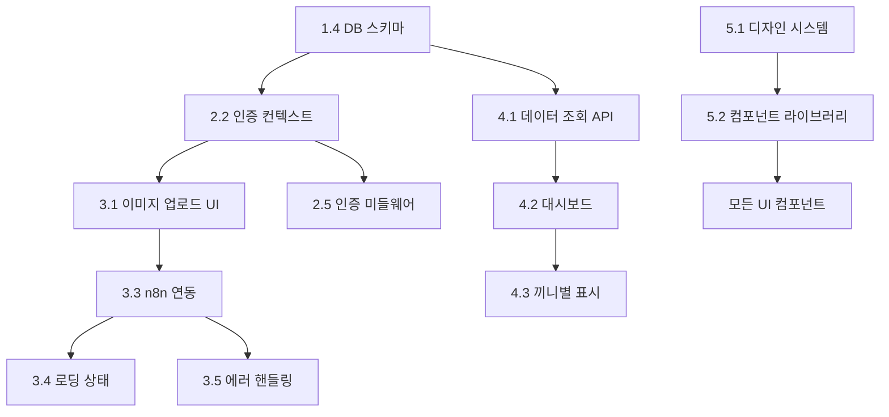

# AI 식단 관리 서비스 MVP 개발 로드맵

## 🗓️ 개발 일정 개요

**전체 예상 기간**: 6-8주  
**핵심 MVP 기간**: 4-5주  
**테스트 및 배포**: 1-2주  
**추가 최적화**: 1주

## 📋 Phase별 개발 계획

### Phase 1: 기반 설정 (1주차)
**목표**: 개발 환경 구축 및 기본 인프라 설정

#### Week 1 - 필수 작업
- [x] ~~프로젝트 초기화~~ (완료)
- [ ] **1.1** 의존성 설치 및 환경 설정 (2-3시간)
- [ ] **1.3** Supabase 프로젝트 설정 (30분)
- [ ] **1.4** 데이터베이스 스키마 설계 (2-3시간)
- [ ] **1.5** Supabase Storage 설정 (1시간)
- [ ] **5.1** 디자인 시스템 구축 (3-4시간)
- [ ] **6.5** 배포 환경 기본 설정 (3-4시간)

**완료 기준**: 
- Supabase 연결 테스트 성공
- 기본 디자인 토큰 정의 완료
- 개발 서버 정상 동작

---

### Phase 2: 사용자 인증 (2주차)
**목표**: 사용자 가입/로그인 시스템 완성

#### Week 2 - 인증 시스템
- [ ] **2.1** Supabase Auth 설정 (1시간)
- [ ] **2.2** 인증 컨텍스트 및 훅 구현 (3-4시간)
- [ ] **5.2** 공통 컴포넌트 라이브러리 (6-8시간)
- [ ] **2.3** 로그인 페이지 구현 (4-5시간)
- [ ] **2.4** 회원가입 페이지 구현 (4-5시간)
- [ ] **2.5** 인증 미들웨어 구현 (2-3시간)

**완료 기준**:
- 사용자 회원가입/로그인 정상 동작
- 보호된 라우트 접근 제어 작동
- 세션 관리 및 자동 갱신 확인

**의존성**: Phase 1 완료 후 진행

---

### Phase 3: 핵심 기능 구현 (3-4주차)
**목표**: 식단 기록의 핵심 "원클릭" 기능 완성

#### Week 3 - 식단 기록 UI
- [ ] **5.3** 네비게이션 시스템 구현 (4-5시간)
- [ ] **5.4** 반응형 디자인 구현 (4-5시간)
- [ ] **3.1** 이미지 업로드 UI 구현 (4-5시간)
- [ ] **3.2** 이미지 처리 및 최적화 (3-4시간)
- [ ] **3.3** n8n 웹훅 연동 클라이언트 (3-4시간)

#### Week 4 - 업로드 플로우 완성
- [ ] **3.4** 로딩 상태 관리 및 UI (2-3시간)
- [ ] **3.5** 에러 핸들링 및 사용자 피드백 (3-4시간)
- [ ] **3.6** 성공 피드백 및 결과 표시 (2-3시간)
- [ ] **4.1** 데이터 조회 API 구현 (3-4시간)

**완료 기준**:
- 이미지 선택 → 업로드 → 분석 → 저장 전체 플로우 동작
- 에러 상황에서 적절한 피드백 제공
- 모바일에서 사용 편의성 확인

**의존성**: Phase 2 완료 후 진행

---

### Phase 4: 대시보드 및 조회 기능 (5주차)
**목표**: 기록된 식단 데이터를 보기 쉽게 표시

#### Week 5 - 대시보드 구현
- [ ] **4.2** 대시보드 메인 페이지 구현 (4-5시간)
- [ ] **4.3** 끼니별 분류 표시 컴포넌트 (4-5시간)
- [ ] **4.4** 상세 식단 보기 모달/페이지 (3-4시간)
- [ ] **4.5** 영양성분 요약 및 차트 (5-6시간)
- [ ] **5.5** 애니메이션 및 인터랙션 (3-4시간)

**완료 기준**:
- 날짜별/끼니별 식단 기록 조회 가능
- 영양성분 요약 정보 표시
- 직관적인 사용자 인터페이스

**의존성**: Phase 3 완료 후 진행

---

### Phase 5: 품질 개선 및 최적화 (6주차)
**목표**: 사용자 경험 향상 및 안정성 확보

#### Week 6 - UX 개선 및 테스트
- [ ] **5.6** 접근성 개선 (4-5시간)
- [ ] **5.8** 성능 최적화 (3-4시간)
- [ ] **5.9** 에러 상태 및 엣지 케이스 UI (2-3시간)
- [ ] **6.1** 단위 테스트 구현 (6-8시간)
- [ ] **6.2** 통합 테스트 구현 (4-5시간)

**완료 기준**:
- Core Web Vitals 목표 달성
- 주요 기능 테스트 커버리지 80% 이상
- 접근성 기준 충족

**의존성**: Phase 4 완료 후 진행

---

### Phase 6: 배포 및 모니터링 (7-8주차)
**목표**: 프로덕션 배포 및 모니터링 설정

#### Week 7-8 - 배포 및 안정화
- [ ] **6.4** 성능 테스트 및 최적화 (4-5시간)
- [ ] **6.6** CI/CD 파이프라인 구축 (3-4시간)
- [ ] **6.7** 보안 및 취약점 검사 (2-3시간)
- [ ] **6.8** 모니터링 및 로깅 설정 (3-4시간)
- [ ] **6.9** 문서화 및 배포 가이드 (2-3시간)
- [ ] **6.3** E2E 테스트 (선택사항) (5-6시간)

**완료 기준**:
- 프로덕션 환경 안정적 동작
- 모니터링 시스템 정상 작동
- 문서화 완료

**의존성**: Phase 5 완료 후 진행

---

## 🔗 의존성 체인

### 핵심 의존성 관계

### 블로킹 관계
- **Critical Path**: `1.4 → 2.2 → 3.1 → 3.3 → 4.1 → 4.2`
- **병렬 가능**: `5.1-5.4 (UI/UX)`, `6.5 (배포 설정)`

---

## ⚠️ 위험 요소 및 대비책

### 높은 위험
1. **n8n 웹훅 연동 실패**
   - 대비책: Mock API 서버 우선 구현
   - 예비 계획: 단순한 이미지 저장만 구현

2. **AI 분석 서비스 불안정**
   - 대비책: 실패 시 수동 입력 옵션
   - 예비 계획: 하드코딩된 샘플 데이터

### 중간 위험
3. **모바일 성능 이슈**
   - 대비책: 이미지 압축 강화
   - 모니터링: Lighthouse 점수 지속 체크

4. **Supabase 할당량 초과**
   - 대비책: 로컬 개발 환경 준비
   - 예비 계획: 다른 BaaS 서비스 조사

---

## 🎯 MVP 최소 기능 범위

### 반드시 포함되어야 할 기능
- [x] ~~프로젝트 초기 설정~~
- [ ] 이메일 기반 회원가입/로그인
- [ ] 이미지 업로드 및 AI 분석 요청
- [ ] 분석 결과 저장 및 조회
- [ ] 끼니별 자동 분류
- [ ] 날짜별 식단 기록 조회
- [ ] 모바일 반응형 UI

### 시간이 부족할 경우 제외 가능한 기능
- [ ] 다크 모드
- [ ] 데이터 내보내기
- [ ] 상세 차트 및 통계
- [ ] 오프라인 지원
- [ ] 고급 애니메이션
- [ ] E2E 테스트

---

## 📊 진행 상황 추적

### 전체 진행률
- **Phase 1 (기반 설정)**: ⬜ 0% (0/6 완료)
- **Phase 2 (인증)**: ⬜ 0% (0/6 완료)
- **Phase 3 (핵심 기능)**: ⬜ 0% (0/8 완료)
- **Phase 4 (대시보드)**: ⬜ 0% (0/5 완료)
- **Phase 5 (품질 개선)**: ⬜ 0% (0/5 완료)
- **Phase 6 (배포)**: ⬜ 0% (0/6 완료)

### 주별 목표 달성률
- **1주차**: ⬜ 준비중
- **2주차**: ⬜ 대기중
- **3주차**: ⬜ 대기중
- **4주차**: ⬜ 대기중
- **5주차**: ⬜ 대기중
- **6주차**: ⬜ 대기중

---

## 📝 매일 체크리스트

### 개발 시작 전
- [ ] 이전 날짜 작업 완료 상태 확인
- [ ] 오늘 목표 작업 계획 수립
- [ ] 의존성 체크 (선행 작업 완료 여부)

### 개발 완료 후
- [ ] 구현한 기능 테스트 수행
- [ ] 코드 커밋 및 푸시
- [ ] 다음날 작업 계획 업데이트
- [ ] 문서 업데이트 (필요시)

---

*이 로드맵은 개발 진행 상황에 따라 지속적으로 업데이트됩니다.*  
*최종 업데이트: 2024-09-24*
